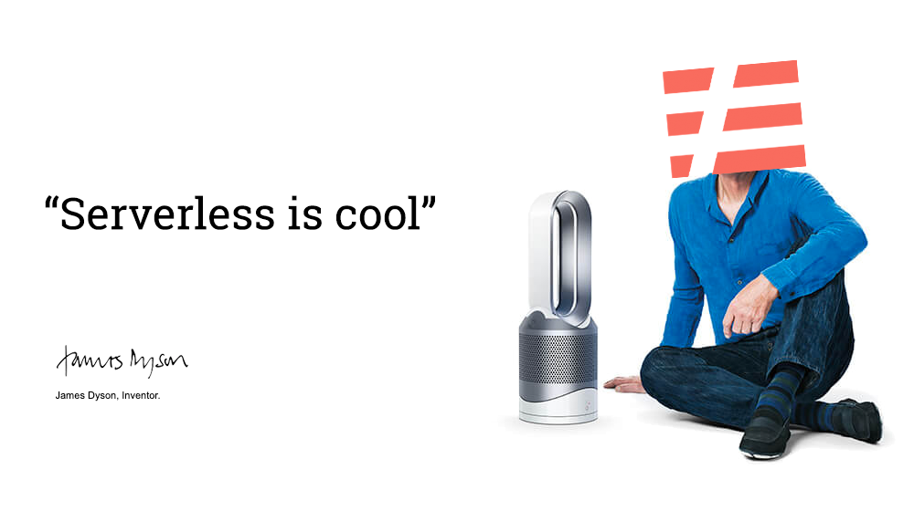

# Serverless Dyson Control Endpoint

Using Dyson Pure Cool Link python library over MQTT & Serverless framework we implement a simple endpoint to control our Dyson device.



## Serverless Setup

### Setup Serverless

```bash
npm install -g serverless
serverless config credentials --provider aws --key <ACCESS KEY ID> --secret <SECRET KEY>
```

### Create the project

```bash
mkdir aws-serverless-dyson
cd aws-serverless-dyson
serverless create --template aws-python3 --name aws-serverless-dyson
```

You will receive the following files created for you

```bash
.
├── .gitignore
├── handler.py
└── serverless.yml
```

### Setup Serverless Project

Create the values for your secrets

```bash
aws ssm put-parameter --name devopstar-dyson-account-email        --type String --value $dyson_account_email
aws ssm put-parameter --name devopstar-dyson-account-password     --type String --value $dyson_account_password
aws ssm put-parameter --name devopstar-dyson-account-region       --type String --value $dyson_account_region
aws ssm put-parameter --name devopstar-dyson-mqtt-public-endpoint --type String --value $dyson_mqtt_public_endpoint
```

Note the enties in the `serverless.yml` file, these will be substituded in for you by Serverless based on the parameters above.

```yaml
service: aws-serverless-dyson

provider:
  name: aws
  runtime: python3.7
  environment:
    DYSON_EMAIL: ${ssm:devopstar-dyson-account-email}
    DYSON_PASS: ${ssm:devopstar-dyson-account-password}
    DYSON_LANG: ${ssm:devopstar-dyson-account-region}
    DYSON_ENDPOINT: ${ssm:devopstar-dyson-mqtt-public-endpoint}

functions:
  stats:
    handler: handler.stats
    events:
      - http:
          path: stats
          method: get
```

### Dyson Endpoint Setup


### Python Requirements

```bash
serverless plugin install -n serverless-python-requirements
```

Add the following to the serveress.yml file

```yaml
plugins:
  - serverless-python-requirements

custom:
  pythonRequirements:
    dockerizePip: non-linux
```

### Deploy

```bash
serverless deploy
```

### Invoke Function

You can invoke your deployed functions using the following

```bash
# Activate a python envirionment locally
python3 -m venv ./venv
source venv/bin/activate
pip install -r requirements.txt

# Test locally
serverless invoke local -f stats
serverless invoke local -f sleep_timer --data '{ "sleep_timer":5 }'

# Test Deployed version
serverless invoke -f stats
serverless invoke -f sleep_timer --data '{ "sleep_timer":5 }'
```

## Attribution

- [UnitedIncome/serverless-python-requirements](https://github.com/UnitedIncome/serverless-python-requirements)
- [CharlesBlonde/libpurecoollink](https://github.com/CharlesBlonde/libpurecoollink)
- [AWS Lambda + Serverless Framework + Python — A Step By Step Tutorial — Part 1 “Hello World”](https://medium.com/devopslinks/aws-lambda-serverless-framework-python-part-1-a-step-by-step-hello-world-4182202aba4a)
- [Managing secrets, API keys and more with Serverless](https://serverless.com/blog/serverless-secrets-api-keys/)
- [Dyson Fan Pure Cool Link Hack!](http://aakira.hatenablog.com/entry/2016/08/12/012654)
